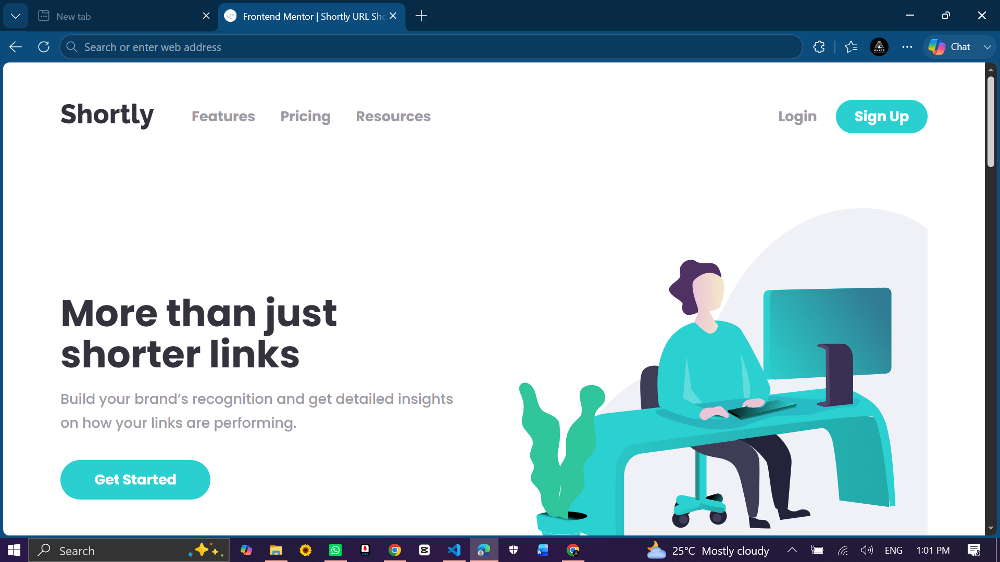
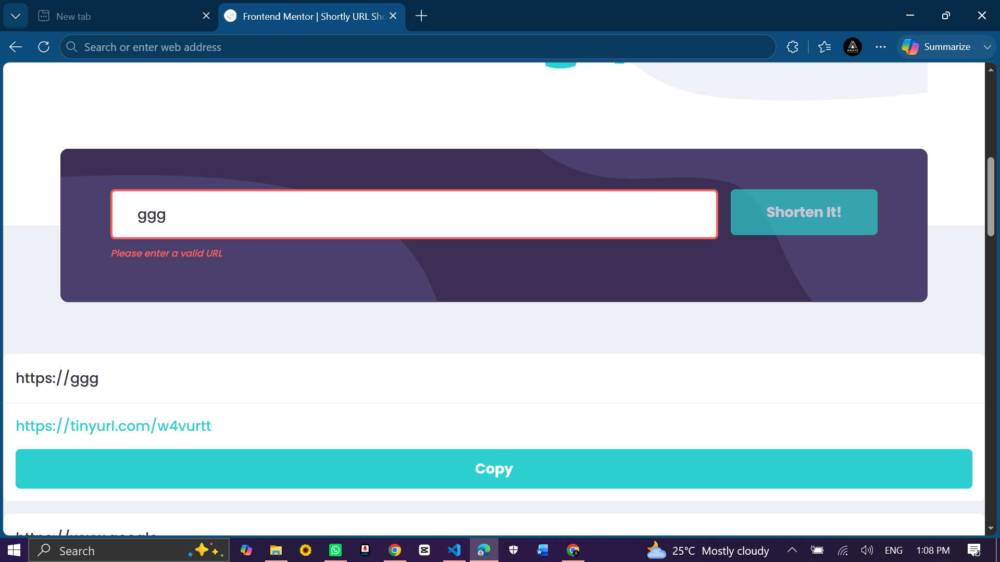
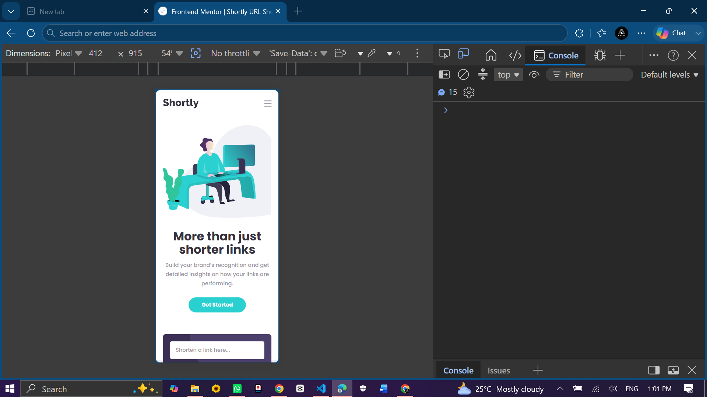

# Shortly URL Shortening API

A responsive URL shortening landing page built with HTML, CSS, and Vanilla JavaScript. Users can shorten links, copy shortened URLs, and keep their shortened links after refreshing the browser using Local Storage.

---

## Screenshots

### Desktop



### Active States



### Mobile



---

## Links

- Solution URL: <https://github.com/maxtapiece/url-shortening-api-master>
- Live Site URL: <https://maxtapiece.github.io/url-shortening-api-master>

---

## Features

- Responsive layout for mobile and desktop
- Mobile navigation menu
- URL input validation
- Automatic URL normalization for links without `http://` or `https://`
- URL shortening using an external API
- Loading state while shortening
- Prevents duplicate shortened links
- Copy shortened link to clipboard
- Temporary `Copied!` button state
- Local Storage persistence after page refresh

---

## Built With

- Semantic HTML5
- CSS custom properties
- Flexbox
- CSS Grid
- Mobile-first workflow
- Vanilla JavaScript
- Fetch API
- Clipboard API
- Local Storage

---

## What I Learned

This project helped me practice working with an external API and handling asynchronous JavaScript using `async` and `await`.

I also learned how to normalize user input. For example, when a user enters `www.google.com`, the app converts it to `https://www.google.com` before sending it to the shortening API. This improves the user experience because users do not always type full URLs.

Another important lesson was managing UI state. Each shortened link is stored as an object containing the original URL, shortened URL, ID, and copied state. This made it easier to render the links, update the copy button, prevent duplicates, and save everything to Local Storage.

```js
const app = {
  links: [],
};
```

I also practiced separating my JavaScript into clear sections:

```txt
Navigation
Application State
Constants
DOM Elements
Local Storage
API
Helpers
Rendering
Event Handlers
Event Listeners
Initialization
```

This made the project easier to understand and maintain.

---

## Challenges

The biggest challenge was working with the URL shortening API. The CleanURI API mentioned in the challenge README caused CORS issues in the browser, so I used TinyURL for the frontend implementation.

Another challenge was making sure the app worked well with different kinds of user input, such as:

```txt
google.com
www.google.com
https://example.com
```

I solved this by creating a `normalizeURL()` helper function.

```js
function normalizeURL(url) {
  url = url.trim();

  if (!/^https?:\/\//i.test(url)) {
    url = `https://${url}`;
  }

  return url;
}
```

---

## Continued Development

In future versions, I would like to:

- Add a backend proxy for the CleanURI API
- Add stronger URL validation
- Add delete functionality for saved links
- Add animations for newly shortened links
- Improve accessibility testing
- Convert the project to React after mastering the Vanilla JavaScript version

---

## Useful Resources

- [Frontend Mentor](https://www.frontendmentor.io)
- [MDN Fetch API](https://developer.mozilla.org/en-US/docs/Web/API/Fetch_API)
- [MDN Clipboard API](https://developer.mozilla.org/en-US/docs/Web/API/Clipboard_API)
- [MDN Local Storage](https://developer.mozilla.org/en-US/docs/Web/API/Window/localStorage)

---

## Author

- GitHub: [@maxtapiece](https://github.com/maxtapiece)
- Frontend Mentor: [@maxtapiece](https://www.frontendmentor.io/profile/maxtapiece)

---

## Acknowledgments

Challenge by Frontend Mentor. Built as part of my frontend development learning journey.
